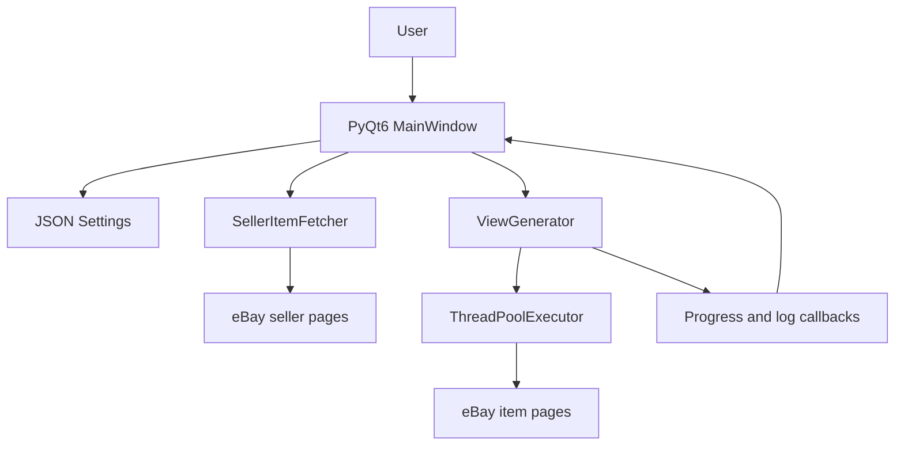

# Architecture

## System Diagram

## Components

- **Desktop UI**: `ebayviews/app.py` owns seller input, item selection, settings, progress, and log display.
- **Seller retrieval**: `ebayviews/fetcher.py` performs best-effort HTML parsing for seller listings and pagination.
- **View generation**: `ebayviews/generator.py` runs bounded concurrent requests with retries, timeouts, user-agent rotation, and optional proxies.
- **Configuration**: `ebayviews/config.py` stores validated settings in `~/.ebayviews/config.json`.
- **CLI compatibility**: `EbayViewBot.py` and `ebayviews/cli.py` preserve single-item command-line usage.

## Key Decisions

- **PyQt6 over a web UI**: keeps the project local and matches the desktop workflow requested by the issue backlog.
- **HTML parsing over official API**: avoids requiring API credentials, with the trade-off that parsing is best-effort and may need maintenance if eBay markup changes.
- **ThreadPoolExecutor over raw threads**: caps concurrency and centralizes result handling.
- **Callbacks over shared UI state**: keeps network work off the Qt main thread while safely emitting progress and log updates.
