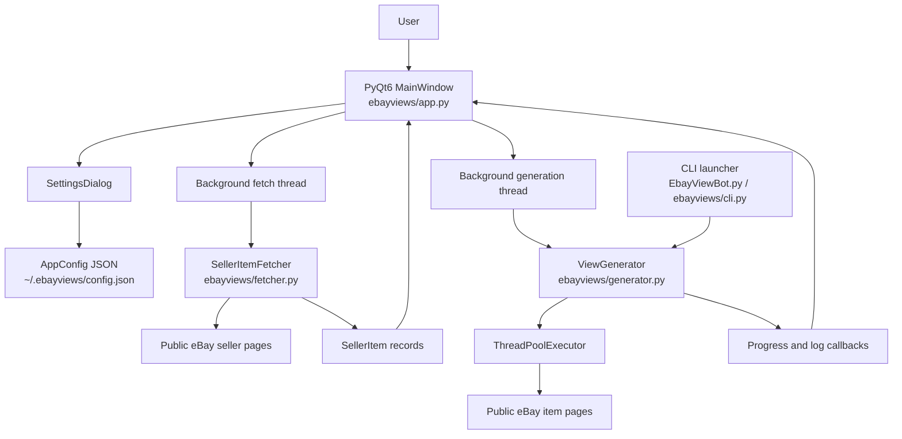

# Architecture

## System Diagram

## Component Descriptions

### Desktop UI
- **Purpose**: Provides the seller URL input, item table, settings dialog, run controls, progress bar, and log area.
- **Location**: `ebayviews/app.py`
- **Key responsibilities**: Keep network work off the Qt main thread, emit UI-safe signals for results/errors, store selected rows, and surface responsible-use warnings.

### Settings and Validation
- **Purpose**: Stores conservative execution controls and validates user input before it affects network behavior.
- **Location**: `ebayviews/config.py`
- **Key responsibilities**: Clamp concurrency to `1–25`, normalize intervals/timeouts/retries/page limits, persist JSON to `~/.ebayviews/config.json`, and load optional proxy lists.

### Seller Listing Retrieval
- **Purpose**: Converts a seller page into structured item records the UI can display and select.
- **Location**: `ebayviews/fetcher.py`
- **Key responsibilities**: Fetch seller pages with `requests`, parse item IDs/titles/prices with BeautifulSoup, follow pagination up to a configured limit, deduplicate listings by item ID, and raise user-friendly errors.

### Request Generator
- **Purpose**: Runs bounded request-generation jobs for selected items.
- **Location**: `ebayviews/generator.py`
- **Key responsibilities**: Build item URLs, rotate user agents, optionally rotate proxies, retry transient failures, collect `RequestResult` records, and report per-item progress.

### CLI Compatibility Layer
- **Purpose**: Preserves the original single-item command-line workflow while sharing the safer request engine.
- **Location**: `EbayViewBot.py`, `ebayviews/cli.py`
- **Key responsibilities**: Parse `--item-id`, `--views`, and `--desktop`; launch either the PyQt app or a single-item generator run.

### Test Harness
- **Purpose**: Keeps the desktop, parsing, generation, settings, and CLI behavior regression-tested.
- **Location**: `tests/`
- **Key responsibilities**: Mock network calls for deterministic tests, run PyQt smoke tests in offscreen mode, and provide an opt-in live seller-page parser check.

## Data Flow

1. The user launches the app with `python -m ebayviews --desktop`.
2. `MainWindow` loads `AppConfig` from `~/.ebayviews/config.json` or falls back to safe defaults.
3. The user enters a seller URL and clicks **Fetch Items**.
4. A background thread calls `SellerItemFetcher.fetch()`, which retrieves seller pages and parses listings into `SellerItem` records.
5. The UI receives the records through a Qt signal and populates a checkable table.
6. The user selects items, adjusts settings if needed, and starts generation.
7. A background thread calls `ViewGenerator.generate()`, which schedules bounded worker-pool requests.
8. Each request returns a `RequestResult`; progress/log callbacks are emitted back to the UI.
9. The UI updates the progress bar and console-style log without blocking the event loop.

## External Integrations

| Service | Purpose | Notes |
|---------|---------|-------|
| Public eBay seller pages | Source pages for listing discovery | Parsed with best-effort HTML selectors; no official API credentials are required. |
| Public eBay item pages | Target pages for request-generation experiments | Requests are throttled through configurable concurrency, interval, timeout, and retry settings. |
| Local filesystem | Stores settings and optional proxy list | Settings live at `~/.ebayviews/config.json`; proxy files are newline-delimited local text files. |

## Key Architectural Decisions

### PyQt6 desktop over browser-based UI
- **Context**: The app needs local controls, a table, a log panel, and settings without hosting infrastructure.
- **Decision**: Use PyQt6 for a native desktop app.
- **Rationale**: PyQt6 gives mature widgets and signal/slot communication out of the box. A web UI would add a server, browser runtime, and extra packaging work for a local tool.

### Best-effort HTML parsing over official API integration
- **Context**: Seller listing discovery should work without API credentials or account setup.
- **Decision**: Parse public seller/listing HTML with BeautifulSoup.
- **Rationale**: This keeps setup simple and testable. The trade-off is that parsing depends on public markup and may need maintenance if eBay changes page structure.

### ThreadPoolExecutor over unbounded raw threads
- **Context**: The original script launched one thread per requested view, which makes it easy to create runaway concurrency.
- **Decision**: Use `ThreadPoolExecutor` behind a validated concurrency limit.
- **Rationale**: A worker pool caps network pressure, centralizes result collection, and still fits the synchronous `requests` client.

### Qt signals over direct UI mutation from workers
- **Context**: Network work must not freeze the desktop window or mutate widgets from background threads.
- **Decision**: Run fetch/generation work in background threads and emit signals for UI updates.
- **Rationale**: Signals keep the UI responsive and respect Qt's threading model while preserving simple worker code.

### Deterministic tests with optional live coverage
- **Context**: eBay availability and markup can vary, but the parser still benefits from an occasional real-page check.
- **Decision**: Mock network behavior in the default suite and gate the live seller-page test behind `EBAYVIEWS_LIVE_TESTS=1`.
- **Rationale**: CI/local validation remains fast and deterministic, while the live check can be run intentionally when verifying current eBay markup.
